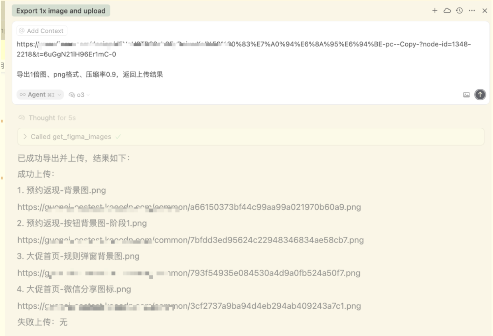

# Figma Structured MCP

这是一个用于与 Figma 链接 交互的 MCP (Model Context Protocol) 服务器。

它将无缝连接Figma物料-项目代码流程，定义新的figma资源交互方式！

拒绝：

手动选择、手动导出、手动压缩、手动上传、手动复制粘贴到项目中。


我们要：

只提供要导出图片的 Figma 链接，即可自动进行导出、压缩、上传，直接返回上传结果的结构化数据。

还要：

结合大模型，创造更多可能！试试让大模型直接帮你把得到的图片链接直接放到项目代码中...


因此，我们将支持：


- �� **Figma API 集成**: 高效导出 Figma 节点或其子节点的图像。
- 🗜️ **智能压缩**: 自动压缩导出的 JPG/PNG 图像以优化文件大小。
- 📤 **自动上传**: 将处理后的图像无缝上传到云存储。
- ⚡ **并发处理**: 支持批量处理节点，提高效率。
- 🔧 **灵活配置**: 可自定义图像格式、缩放比例和压缩质量。
- 🎯 **精准控制**: 可选择导出节点本身或其所有子节点。


未来它将支持更多有用的Figma结构化数据的转换和输出，因为它叫做：Figma Structured MCP！


## 核心工具

### `get_figma_images`

从Figma导出、压缩并上传指定节点的图像，返回可公开访问的图像URL。

此工具自动化处理从Figma提取设计素材的整个流程：
1. 根据提供的 `file_key` 和 `node_ids` 从Figma API获取图像。
2. 可选择导出节点本身或其所有直接子节点（通过 `export_children` 参数控制）。
3. 对导出的图像进行压缩以优化文件大小。
4. 将处理后的图像上传到云存储。
5. 返回一个包含成功上传图像的URL列表和失败详情的字典。

**重要提示:**
- **环境变量**: 此工具需要 `FIGMA_ACCESS_TOKEN` 环境变量。请确保在运行前已设置。
- **如何从Figma链接中提取参数**:
  - 当用户提供一个Figma链接时，需要从中提取 `file_key` 和 `node_ids`。
  - 例如，对于链接: `https://www.figma.com/design/d5VnH9TP69zb3EyDejwv/My-Design?node-id=1349-2219`
  - `file_key` 是 `d5VnH9TP69zb3EyDejwv` (位于 `design/` 或 `file/` 之后的部分)
  - `node_ids` 是 `1349-2219` (位于 `?node-id=` 之后的部分)

**参数:**
- `file_key` (str): Figma文件的唯一标识符。从文件URL中 'file/' 或 'design/' 之后的部分提取。
- `node_ids` (str): 一个或多个逗号分隔的Figma节点ID。从URL的 `?node-id=` 参数中提取。
- `format` (str): 导出图像的格式。支持 "jpg", "png", "svg", "pdf"。默认为 "png"。
- `scale` (float): 图像的缩放比例，取值范围在 0.01 到 4 之间。默认为 1.0 (原始尺寸)。
- `compression_quality` (float): 图像压缩质量，仅对'jpg'和'png'格式有效。取值范围 0.0 (低质量，高压缩) 到 1.0 (高质量，低压缩)。默认为 0.85。
- `export_children` (bool): 控制导出行为。
    - `True` (默认): 导出指定`node_ids`下所有直接子节点作为独立的图像。适用于需要节点内多个图层（如图标、图片素材）的场景。
    - `False`: 仅导出`node_ids`指定的节点本身，将其作为一个整体图像。当用户明确指定将节点本身导出时使用。

**返回数据格式:**
```json
{
    "successful_uploads": [
        {
            "name": "image_name.png",
            "url": "https://cdn.example.com/image_name.png"
        }
    ],
    "failed_uploads": [
        {
            "name": "failed_image.png",
            "error": "Upload failed reason"
        }
    ]
}
```

## 安装与运行

### 前置要求

- Python 3.12 或更高版本
- UV 包管理器

### 1. 安装 UV (如果尚未安装)

```bash
pip install uv
```

### 2. 创建虚拟环境并安装依赖

```bash
# 使用 UV 创建虚拟环境
uv venv --python 3.12

# 激活虚拟环境 (macOS/Linux)
source .venv/bin/activate
# 激活虚拟环境 (Windows)
# .venv\Scripts\activate

# 安装所有依赖
uv sync --all-extras
```

### 3. 配置环境变量

**使用 `.env` 文件**
在项目根目录下创建一个名为 `.env` 的文件，并将你的Figma访问令牌放入其中。
```
FIGMA_ACCESS_TOKEN="your_figma_token_here"

# 其他上传服务器配置
STORAGE_PROVIDER="custom"
CUSTOM_UPLOAD_URL="https://your-upload-server.com"
CUSTOM_UPLOAD_KEY="your_upload_key_here"

```

### 4. 运行服务

项目支持三种运行模式：

**1. STDIO 模式（标准 MCP 模式）**
```bash
uv run python run.py --mode stdio
```

**2. HTTP 模式（Streamable-HTTP）**
```bash
# 启动 HTTP 服务器，默认端口 8000
uv run python run.py --mode http --port 8070

# 服务地址：http://127.0.0.1:8070/mcp
```

**3. SSE 模式（Server-Sent Events）**
```bash
# 启动 SSE 服务器，默认端口 8001
uv run python run.py --mode sse --port 8080

# 服务地址：http://127.0.0.1:8080/sse
```

### 5. 在客户端中使用

该工具支持三种模式：
- STDIO 模式
- HTTP 模式
- SSE 模式

可在任意支持MCP服务的客户端使用，以Cursor为例：

**方法一：STDIO 模式（推荐）**
在 Cursor 设置中添加 MCP 服务器配置：
```json
{
  "mcpServers": {
    "figma-structured": {
      "command": "python",
      "args": ["/Users/yululiu/projects/AI/figma-structured-mcp/run.py", "--mode", "stdio"],
      "env": {
        "PATH": "/Users/yululiu/projects/AI/figma-structured-mcp/.venv/bin:$PATH",
        "PYTHONPATH": "/Users/yululiu/projects/AI/figma-structured-mcp",
      }
    }
  }
}
```

也可以 添加以下参数，会覆盖 .env 中的配置
```json
"env": {
  "FIGMA_ACCESS_TOKEN": "your_figma_token_here",
  "STORAGE_PROVIDER": "custom",
  "CUSTOM_UPLOAD_URL": "your upload url",
  "CUSTOM_UPLOAD_KEY": "your upload key"
}
```

**方法二：HTTP/SSE 模式**
1.  先启动 HTTP 或 SSE 服务。

```bash
uv run python run.py --mode http --port 8070 # 启动 HTTP 服务

uv run python run.py --mode sse --port 8070 # 启动 SSE 服务
```

2.  在 Cursor 中配置相应的 URL。

   **Cursor HTTP 模式配置示例：**
```json
{
  "mcpServers": {
    "figma-structured-mcp": {
      "url": "http://127.0.0.1:8070/mcp"
    }
  }
}

{
  "mcpServers": {
    "figma-structured-mcp": {
      "url": "http://127.0.0.1:8070/sse"
    }
  }
}
```

与大模型交互示例

